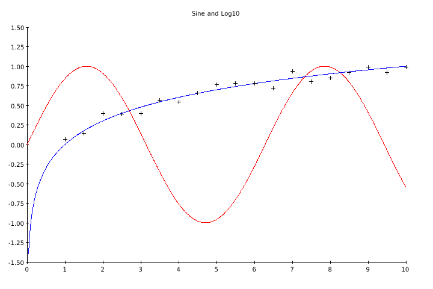

# Nimetry - Plotting in Pure Nim

This is a WIP, and as such will be changing frequently. [See documentation here](https://ijneb.github.io/nimetry/).

## Example

```nim
var
  data: Dataset
  data2: Dataset

for x in 0..1000:
  data.add((x: x/100, y: sin(x/100)))
  data2.add((x: x/100, y: log10(x/100)))

var
  p: Plot = newPlot(720, 480)

p.setX(0, 10)
p.setY(-1.5, 1.5)

p.setXtic(1)
p.setYtic(0.25)

p.addGraph(data, rgba(255, 0, 0, 255))
p.addGraph(data2, rgba(0, 0, 255, 255))

p.setFontTtf("fonts/Vera.ttf")
p.setTitle("Sine and Log10")

p.save("test.png")
```


