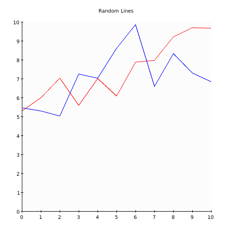

# Nimetry - Plotting in Pure Nim

This is a WIP, and as such will be changing frequently.

## Documentation

[See documentation here](https://ijneb.github.io/nimetry/).

## Example Outputs

*Look in 'examples' folder to see code*
